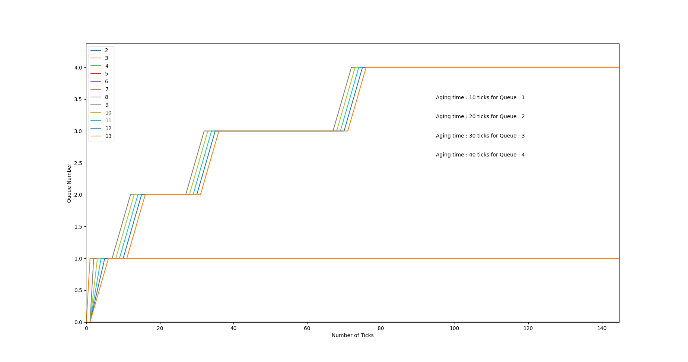

<!-- file is written in markdown format -->

# Assignment-4: Enhancing xv6 OS

```
Names : Swayam Agrawal , Mitansh Kayathwal
Roll Nos: 2021101068 , 2021101026
Branch : CSE
Course : Operating Systems and Networking , Monsoon'22

OS:Linux
```

# **_Specification 1 : strace_**

The `strace` system call has been implemented in `strace.c`. The mask is set to the process and is inherited while forking the parent process. The system calls indexed by the set bits of the mask are tracked. Execute the command as follows :

```
strace <mask> <command>
```

# **_Specification 1 : sigalarm_**

`sigalarm` and `sigreturn` system calls have been implemented. A feature to xv6 that periodically alerts a process as it
uses CPU time. This might be useful for compute-bound processes that want to limit how much CPU time they chew up, or for processes that want to compute but also want to take some periodic action. If an application
calls `alarm(n, fn)` then after every `n` "ticks" of CPU time that the program consumes the kernel will cause application function `fn` to be called. When `fn` returns, the application will resume where it left off.
`sigreturn` : to reset the process state to before the handler was called. This system call is made at the end of the handler, so the process can resume where it left off.

We maintain a track of ticks which have already passed by `completed_clock_val` and to store the value passed by syscall `ticks`. We also store the handler function address. After the handler function returns, time interrupt can still occur.
Hence, we store the values in all the variables. The variables we store to trapframe are overwritten when the function expires, thus we maintain a `cpy_trapframe` to store the values. A tester is also included to test if the system calls work perfectly : alarmtest.c.

Test the system_calls as follows :

```
alarmtest
```

# **_Specification 2 : Scheduling_**

The default scheduler of xv6 is round-robin-based. In this task, we have implemented four
other scheduling policies and incorporated them in xv6. The kernel shall only use one
scheduling policy which will be declared at compile time, with default being round-robin(RR)
in case none is specified.

## FCFS
General Algorithm:
1. We iterate through all the processes and select the process with the minimum creation time.
2. To maintain the creation time of a process, we create a variable in the `struct proc` and initialize it with the value of the global `ticks` variable in `allocproc`.
3. In the `scheduler` loop, we acquire the lock before checking to see if it should be selected or not. If it is then we do not release the lock.
4. We release the lock only when we find a better pick.
5. Once we have our pick, ensure that there was at least one process there to schedule.We now context switch to the process, thereby executing it.
6. We also disabled `yield()` in `trap.c` due to timer interrupts. This disables process preemption.

## LBS:
General Algorithm:
1. LBS is made to be a preemptive scheduler that assigns a time slice to the process randomly in
   proportion to the number of tickets it owns i.e. the probability that the process runs
   in a given time slice is proportional to the number of tickets owned by it.
2. A system call int set_tickets(int number), which sets the number of tickets of
   the calling process has been implemented. By default, each process should get one ticket; calling this routine
   makes it such that a process can raise the number of tickets it receives, and thus receive a higher proportion of CPU cycles.
3. We assign tickets to a process when it is created. We have made sure a child process inherits the same number of tickets
   as its parents.
4. To generate the random lottery_number we have used a random generator taken from stackoverflow.

## PBS
General Algorithm:
1. Here, we follow a similar strategy of FCFS. In `allocprocess` function : we give all the processes a static priority of 60.
2. We keep a track of the number of times a process was scheduled to run.
3. We write a function `update_time` which runs in every timer interrupt where it simply iterates through the list of all processes and update the values of : `run_time`, `sleep_time`, etc and other variables of all of them which count the time process has spent in various states.
4. Now we just implement the logic for the given formulas in the scheduler and make it schedule on the basis of formula given (calculated DP value).
5. We also implemented a new syscall which modifies the value of static_priority a process has : `set_priority`.
6. Disabled process preemption.

## MLFQ
General Algorithm:
1. In order to implement `MLFQ`, five types of queues are initialized. Each of these queues can hold `NPROCS+1` number of processes. The processes are stored in the qeueue(struct proc \*).
2. During the cycle of the execution, the process moves between different queues and hence has different time slices for execution. The array `age_queue` contains the aging threshold for each of the queues.
3. To avoid starvation, different ages have been considered for different queues. While scheduling, a non-empty queue is first selected and then a process from this non-empty queue is selected. This process is scheduled. If the process is runnable, context is switched. During aging, a process moves from a lower priority queue into a higher priority queue. Conversely, during overshot, a process moves from a lower priority queue to a higher priority queue. Overshots have been handled in `usertrap` and `kerneltrap` functions in `trap.c`.
4. Handling has also been done for a lower priority process which is running and a higher priority process enters then the scheduler pre-empts.
5. A variable quantums_used has been maintained to check that no process can take Complete Control of the CPU.if the value of this variable becomes less than or equal to 0 then this process is pre-empted.
6. The array `queue_run_time` maintains the total time spent waiting and running at a particular priority level.

## Answer to Question regarding MLFQ

After predefined timer interrupt for each queue occurs, the process is demoted to a lower priority queue. This allows the other processes to come forward as well. But if a process voluntarily relinquishes control of the CPU, it leaves the queuing network, and when the process becomes ready again after the I/O, it is inserted at the tail of the same queue, from which it is relinquished earlier. A process can exploit the given condition by yielding the CPU before finishing its allocated time, retaining its priority and blocking lower priority processes from running unless aging is implemented.

```
make clean
make qemu SCHEDULER=<FCFS/RR/MLFQ/LBS/PBS>
```

# **_Specification 3 : Copy-on-write fork_**

The idea behind a copy-on-write is that when a parent process creates a child process
then both of these processes initially will share the same pages in memory and these
shared pages will be marked as copy-on-write which means that if any of these
processes will try to modify the shared pages then only a copy of these pages will be
created, and the modifications will be done on the copy of pages by that process and
thus not affecting the other process.

The basic plan in COW fork is for the parent and child to initially share all physical
pages, but
to map them read-only. Thus, when the child or parent executes a store instruction, the
RISC-V
CPU raises a page-fault exception. In response to this exception, the kernel makes a
copy of the
page that contains the faulted address. It maps one copy read/write in the child’s
address space and the other copy read/write in the parent’s address space. After
updating the page tables, the kernel resumes the faulting process at the instruction that
caused the fault. Because the kernel has updated the relevant PTE to allow writes, the
faulting instruction will now execute without a fault.

The original fork() calls `uvmcopy` to configure new physical pages for the child process and copy the contents of the parent process. But now we just need:

Mark duplicate pages by setting a flag.
Cancel copy page writable flag PTE_W.
The virtual memory of the child process is mapped to the copied page.
In this way, when trying to modify the memory content later, the page fault can be triggered, and when entering the trap process, we can determine the processing method through the set flag.

Modify `usertrap()` to recognize page faults. When a page-fault occurs on a COW page, allocate a new page with `kalloc()`, copy the old page to the new page, and install the new page in the PTE with PTE_W set. We map the new page to the pagetable. We execute `kfree()` to free the previous page which is a cow page if no process owns it.

# Analysis of Scheduling Algorithms
## Peformance Comparison:

The shown rtime and wtime are with CPUS=1 for the sake of comparison

### RR:

```
Average rtime 15,  wtime 160
```

### FCFS:

```
Average rtime 34,  wtime 135
```

### LBS:

```
Average rtime 14,  wtime 149
```

### PBS:

```
Average rtime 15,  wtime 127
```

### MLFQ:

```
Average rtime 16,  wtime 164
```

The high wait time of MLFQ is due to a high overhead in queue insertion and queue deletion.


